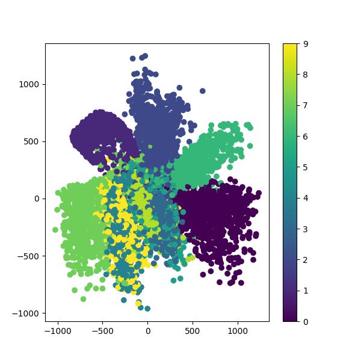
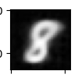
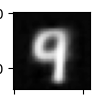
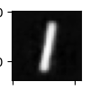
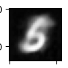

# simple-autoencoder

Convolution과 Transposed convolution을 활용한 간단한 오토인코더입니다. VAE가 아닙니다!  
새로운 MNIST 숫자 데이터를 생성할 수 있으며, 다른 데이터(특히 이미지) 생성기로도 활용할 수 있습니다.
- - -
## 이미지 샘플

 
위 그래프는 2차원 latent space 상의 데이터의 분포를 나타낸 것입니다. 모양 자체는 양호하나 AE 구조의 한계 상 굉장히 넓은 분포를 보이고 있습니다.

---

 
위 이미지는 latent space 상의 값의 변화에 따라 생성되는 숫자가 서서히 변화하는 모습을 나타낸 것입니다. 한 숫자에서 다른 숫자로 자연스럽게 변화합니다.

---

 
임의의 latent vector을 입력으로 사용하여 새로운 이미지를 생성할 수도 있습니다. 위 이미지는 예시입니다.

---

## simple_ae.py
네트워크를 구성하고 MNIST 데이터셋을 학습합니다. 학습이 완료되면 모델을 저장하고 latent space 상의 데이터 분포를 출력합니다.

## generate.py
모델을 불러오고 사용자의 입력을 받아 숫자를 생성합니다.

## model.h5
사전 학습된 모델입니다.
